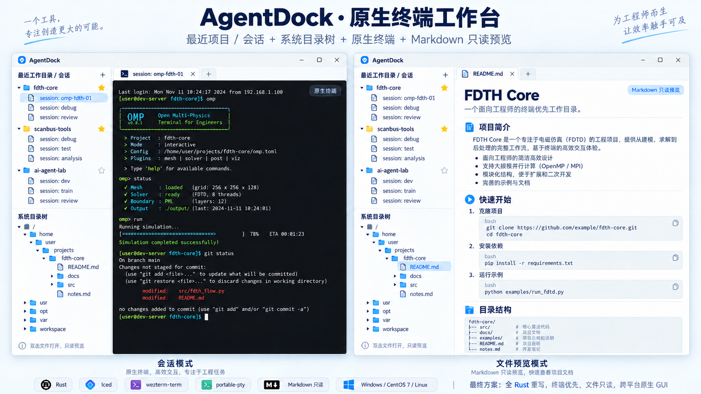

# AgentDock · 原生终端工作台

把项目、OMP 会话、原生终端和 Markdown 预览放进一个工作台，让日常开发少一些窗口切换。

**Rust · Iced · 原生 PTY · OMP 会话 · Markdown 只读预览 · MIT**



*界面设计示意，可点击[查看原图](设计图/设计图.png)。两侧展示同一应用的会话与文件预览模式；图中的项目、Linux 路径和仿真内容为示例，实际接入 Oh My Pi（OMP）Agent 会话。*

- **按项目找回会话**：查看 OMP 历史标题，双击恢复指定会话，常用项目星标置顶。
- **多个终端随时切换**：每个标签承载独立 PTY，切换标签或查看文件时，其他终端继续运行。
- **文档就在手边**：从目录树打开 Markdown 或源码，只读预览，代码块可直接复制。
- **按需浏览目录**：后台分页读取，列表只绘制可见行。

程序显示名称为 AgentDock，Cargo 包和可执行文件名为 `agentdock`。

**Windows 验证状态（2026-09-07）：已编译并实际打开 GUI，最近一次 Release 验证的 44 项 Rust 测试通过，
包含真实 ConPTY 输入输出与尺寸调整。界面已按参考图调整为蓝白侧栏、文件图标、
浅色标签、深色终端和 Markdown 只读预览。CentOS 7 尚未编译或实机验证。**
最新会话验证见 [verification/OMP.md](verification/OMP.md)，首次 Windows 验证见 [verification/WINDOWS.md](verification/WINDOWS.md)，初始源码交付记录保留在
[verification/REPORT.md](verification/REPORT.md)。

Windows 日常使用请打开优化版 `target/release/agentdock.exe`，或在项目目录执行：

```powershell
cargo run --release --locked -- --project . --open examples/fdth-core/README.md
```

`examples/fdth-core/README.md` 是参考图排版样例，不附带真实仿真工程。

性能修复与实测见 [verification/PERFORMANCE.md](verification/PERFORMANCE.md)。
Debug 构建用于开发调试；软件渲染界面的日常运行使用 Release。

## 产品与实现

| 部分 | 实现 |
| --- | --- |
| 应用语言 | Rust，禁止本仓库中的 unsafe Rust；没有 C++ 应用层 |
| GUI | Iced 0.14.0，自定义虚拟列表、终端控件和分隔线 |
| 渲染 | tiny-skia 软件渲染；Linux 显式开启 X11，不开 wgpu / Wayland |
| 终端解析 | wezterm-term，固定上游 20240203-110809-5046fc22 |
| PTY | portable-pty 0.9.0：Unix PTY / Windows ConPTY |
| 文件读取 | 后台线程，目录按页读取，文件仅明确打开时读取 |
| Markdown | Iced Markdown 解析及自定义 Viewer，标题分隔线、浅色代码块与逐块复制；可切换只读源码 |
| 状态 | JSON，单写者锁、临时文件和原子替换；不保存终端输出 |

软件渲染是构建配置，不是已获得的无 GPU 实机测试结果。仍然需要 X11 显示
服务器、字体和相应系统库。应用语言使用 Rust，不等于操作系统及所有传递
依赖的每一行代码都是 Rust。完整兼容性边界见 [COMPATIBILITY.md](docs/COMPATIBILITY.md)。

## 界面行为

左上只放工作目录和其会话；项目右侧 `★ / ☆` 切换置顶，置顶项目先于其他项目。
目录旁 `+` 创建一个新的 OMP Agent 会话。上方 `+` 使用当前选中的项目，没有选中
时使用最近项目。单击目录行展开或收起会话。

左下只以操作系统根目录为入口，不额外放置项目根节点。Linux 从 `/` 开始；Windows 在后台探测盘符。
单击目录才枚举其内容；单击文件只选中，**双击文件才读取并打开预览**。
目录右侧也有星标与新建会话按钮，可把新目录加入左上区域。

右侧终端标签承载独立 PTY。查看文件或切换标签不会重启或结束其他终端；后台
终端出现新输出时，左侧会话显示圆点。关闭运行中的终端或退出程序要求确认。
可拖动左右分隔线及左侧上下分隔线。没有独立的编辑或保存文件操作。

## 构建与验证

需要 Rust / Cargo，以及 `rustfmt`、`clippy`。Iced 所选版本要求 Rust 1.88
或以上；当前锁定依赖已在 Windows Rust 1.98.0 上构建，未验证最低可用工具链。
其他构建机器仍需自行准备工具链和平台依赖。

当前已包含首次 Windows 成功构建生成的真实 `Cargo.lock`，后续使用 `--locked`
保持依赖版本一致。本次工具链为 Rust 1.98.0；`rust-toolchain.toml` 仍跟随 stable。
源码不包含第三方依赖源码，它不是离线依赖包。

Linux / macOS 上的辅助脚本（应用正式目标仍是 Windows/Linux）：

```bash
bash scripts/verify.sh
cargo run --release --locked -- --project /absolute/path/to/project
```

Windows PowerShell 7：

```powershell
./scripts/verify.ps1
cargo run --release --locked -- --project 'D:\work\my-project'
```

`verify` 脚本会先执行 `cargo fmt --all` 整理仓库源码，然后执行
`cargo check`、`cargo test`、`cargo clippy` 和真实 PTY 往返自测。没有工具链会以
非零状态退出，不会伪装成功。使用脚本前阅读脚本内容和兼容性说明。依照 AGENTS.md，执行前须将临时目录、下载输出及验证状态目录配置到项目 .tmp/；现有脚本不会统一配置这些路径。

只做无需 Rust 的仓库结构检查（Python 3.11+）：

```bash
python scripts/source_checks.py
python -m unittest discover -s scripts -p 'test_tools.py' -v
```

可选的 Pygments / PyYAML 增加 Rust 词法括号检查和 YAML 检查。**词法检查
不检查 Rust 类型、借用关系、crate API 或链接，也不等于 Rust 测试通过。**

Linux 构建后可执行 Xvfb 冒烟：

```bash
bash scripts/gui-smoke.sh
```

该脚本只证明窗口事件循环能够启动和退出，不证明中文输入法、画面质量或终端
兼容性。CI 已提供 Ubuntu 22.04 和 Windows 2022 工作流，但本次没有触发或执行。

## 启动 Agent

直接启动 OMP，不重新实现它的聊天 UI：

```bash
cargo run --release --locked -- --project /absolute/project --profile work
```

参数必须各自传入，不拼接成 shell 语句：

```bash
cargo run --release --locked -- --project /absolute/project --command python --arg -i
```

默认直接启动 OMP Agent；`--profile NAME` 或 `--profile=NAME` 传给 OMP。未指定时
遵循 `OMP_PROFILE` / `PI_PROFILE`，否则使用默认 profile。应用不包含
这些 Agent，不代理它们的 API，不提供额度或登录功能。传给 `--command` 的
命令必须在本机可执行；Windows 的 `.ps1/.cmd` 脚本需显式选择其解释器。

只读打开文件：

```bash
cargo run --release --locked -- --open examples/README.md
```

## 会话持久化的准确含义

左侧“会话”读取当前 OMP profile 的真实 JSONL 历史，按头部工作目录分组。
只读取标题和会话头部，不加载聊天正文或认证配置。后台每 5 秒检查元数据变化，
未变化的文件使用缓存。默认路径为 `~/.omp/agent/sessions`；命名 profile 使用
`~/.omp/profiles/NAME/agent/sessions`，并支持 OMP 的目录环境变量。

单击未运行的历史只选中；双击在其工作目录执行
`omp --profile NAME --resume /完整路径/所选会话.jsonl`，恢复所选记录。
这里采用用户确认后的“精确恢复”，不使用只会继续最近一条的 `omp -c`。
已经运行的标签直接切换，不重复启动 OMP。`+` 启动新的 OMP Agent 会话。
旧版普通 Shell 的占位历史不会再冒充 OMP 历史。

AgentDock 保存项目、星标和历史文件引用；聊天记录仍由 OMP 保存。退出 GUI 不保活进程。

默认状态路径：Windows `%LOCALAPPDATA%\AgentDock`；Linux
`${XDG_STATE_HOME:-$HOME/.local/state}/agentdock`。也可用 `AGENTDOCK_HOME` 或 `--state-dir`。
改名前的 DevHub 状态不会自动迁移；需要沿用时，通过 --state-dir 指定原状态目录。相同状态目录不允许两个写入实例。状态中的启动参数会明文保存，不应将密钥放入
命令行参数；使用 Agent 自己的凭据管理。

## 性能边界

目录总量不会引起启动时整盘扫描。单目录每页默认 256 条，缓存最多 64 个展开
节点，UI 只画当前可见行。一个含千万文件的目录也不会一次装载所有条目，但
读取下一页仍需要实际 I/O；向后翻页可能重新枚举此前的页，排序仅在页内成立。
网络文件系统延迟不会被“虚拟化”消除，目录变化期间翻页也不是快照。

同时保留最多 16 个终端，默认每个终端 10000 行回滚。PTY 队列有界；GUI 按时间
和字节预算处理输出。背压可能降低高速程序输出速度，不承诺无限吞吐。

文件默认最多读取 2 MiB，超出会明确标记截断；每页显示最多约 64 KiB / 600 行。
Markdown 跨页结构可能断开，可切换源码阅读。支持 UTF-8 与带 BOM 的 UTF-16；
其他文本编码可能显示替代字符。二进制、目录、设备和管道不作为普通文本预览。

## 终端验收边界

源码已实现 ANSI/VT 解析、颜色/字形属性、宽字符、键盘编码、IME 事件桥接、
鼠标上报、选择复制、粘贴、回滚、PTY 尺寸同步和 alternate screen。
但自定义绘制与输入层是新代码，**不等于成熟 WezTerm GUI 的完整体验**。
没有继承用户 WezTerm fork；已实测 OMP 启动和指定历史恢复，尚未完整验收 vim、中文输入法或远程桌面环境。

当前不做 Sixel/iTerm2/Kitty 图片显示、跨单元格字体连字、双向文字完整排版、
可访问性树、脱离 GUI 的进程守护、SSH 管理或 Git Diff。
终端滚动条为位置提示，历史滚动通过滚轮或 Shift+PageUp/PageDown；目录列表
滚动条可拖动。详细实机验收清单见 [ACCEPTANCE.md](docs/ACCEPTANCE.md)。

## 目录结构

```text
src/
  cli.rs              命令行入口参数
  model.rs            项目、会话和配置
  omp.rs              OMP profile 路径、历史头部读取和扫描缓存
  persistence.rs      单写者、原子保存
  paths.rs            原生路径编码
  files.rs            后台分页枚举和只读预览
  terminal/           VT 内核、PTY、输入映射
  ui/                 Iced 主界面、虚拟列表、终端控件、分隔线
scripts/              构建、静态检查、ABI 审计、打包工具
examples/             配置、Markdown 和终端探针
verification/         各阶段验证报告（历史结果不代表当前全部验收状态）
设计图/               最新产品效果图
.tmp/                 临时文件、下载及新生成的验证产物（Git 忽略）
```

原创代码 MIT。上游 API 依据和许可证说明见 [SOURCES.md](docs/SOURCES.md)。
